# CheckMate [](https://github.com/MOI-razrabotki/CheckMate)
> Шахматная доска с голосовым управлением и автоматизацией перемещения фигур

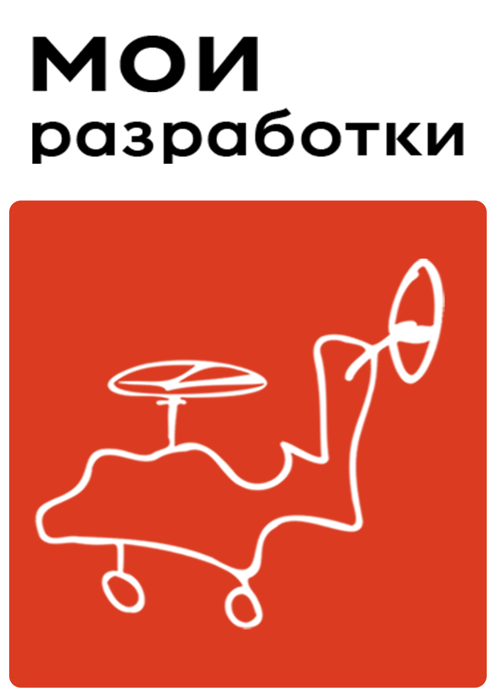

**CheckMate** ```(ЧекМейт)``` - это автоматизированные роботизированные шахматы с голосовым управлением. Игра идет против искусственного интеллекта, устройство воспринимает голосовые команды человека, а система перемещения выставляет фигуру на заданную позицию. Предмет автоматизации заключается в том, что человек не должен касаться игрового поля или фигур во время шахматной партии.

Работа над проектным решением велась с учетом следующих ограничений:
* Разметка поля и схема расположения шахматных фигур соответствуют классическим шахматам.
* Отработанные фигуры должны парковаться в отдельные поля для белых и черных фигур.
* Сторона квадрата клетки игрового поля должна удовлетворять условию: ```a < 1,8d```, где ```d``` — диаметр подошвы фигуры
* Габариты устройства не превышают размеров ```800х800х800мм```.
* Конструкция шахмат вместе с системой перемещения должна размещаться в едином корпусе и быть устойчивой в процессе перемещения.

<p align="center">
  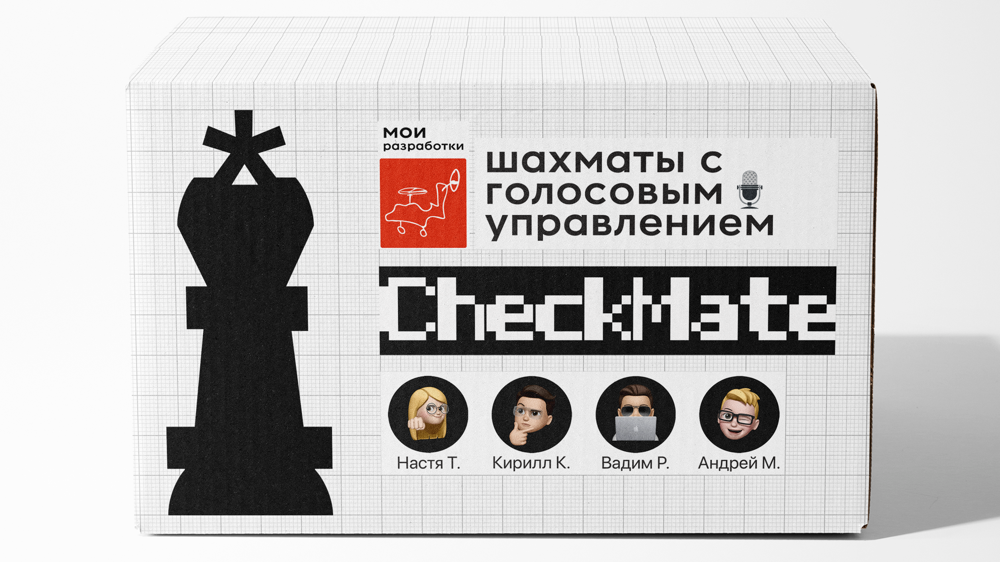
</p>

## Состав команды «МОИ разработки»
1. **Настя** занималась оформлением и представлением всех результатов командной работы.
2. **Кирилл** подбирал необходимые материалы и комплектующие, он был ответственен за монтаж электротехнической схемы и сборку всего устройства. Также был оператором и монтажером видеоматериалов.
3. **Вадим** работал с микрокомпьютером Raspberry Pi. Он разрабатывал программное обеспечение для всей системы, выстраивал алгоритмы искусственного интеллекта, распознавания речи, передвижения фигур.
4. **Андрей** визуализировал в системе автоматизированного проектирования трехмерные модели совместно разработанного прототипа, его составных частей.

## Видео с разработанным продуктом
* Командное видео с разработанным продуктом https://youtu.be/5s41Iof64gM
    [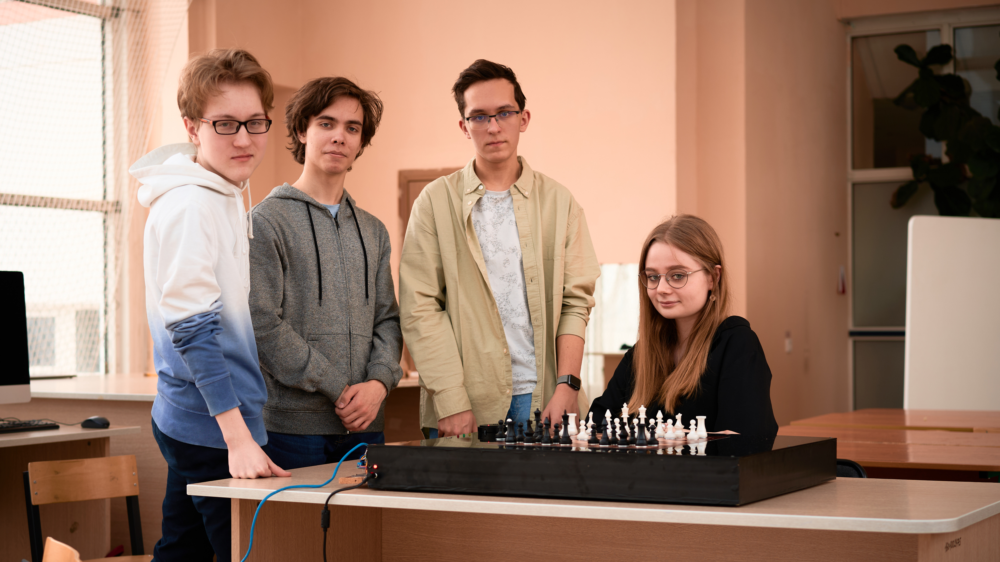](https://youtu.be/5s41Iof64gM)
* Видео с полной демонстрацией функционирования продукта https://youtu.be/BVJHFvGekIg
    [](https://youtu.be/BVJHFvGekIg)

## Кратко о функционале

<p align="center">
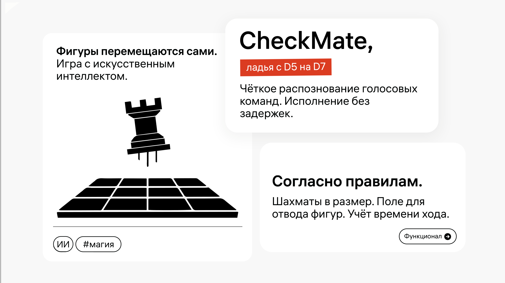
</p>
<p align="center">
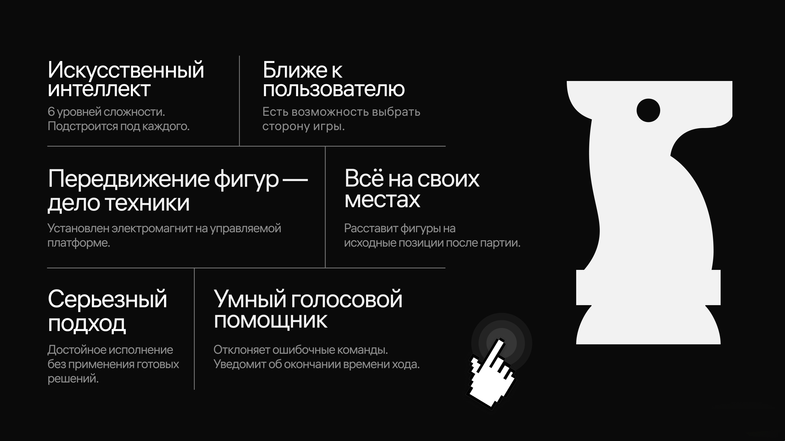
</p>

> Здесь мы описали основной функционал нашей доски, но будем его расширять. Что мы планируем сделать в будущем, читайте в прикрепленном отчете.

## Руководство пользователя

<p align="center">
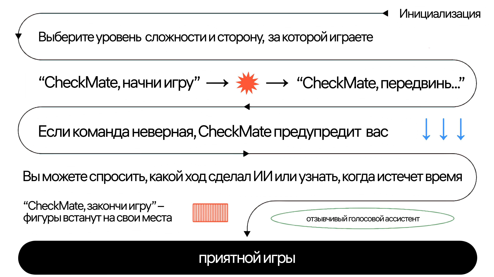
</p>

## Основные компоненты

Электромагнит, закрепленный на управляемой платформе, служит для захвата заданной фигуры в определенном квадрате шахматного поля. В основании фигуры закреплен неодимовый магнит небольшого размера. Принцип перемещения фигуры заключается в том, что в необходимый момент времени электромагнит включается, примагничивает фигуру и передвигает ее по нужному пути следования.

<p align="center">
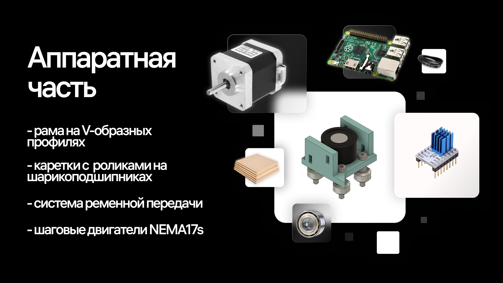
</p>

## Фотографии

<p align="center">

</p>
<p align="center">

</p>
<p align="center">

</p>
<p align="center">

</p>
<p align="center">

</p>
<p align="center">

</p>
<p align="center">

</p>

## 3d-Модели

**⚠️ Чтобы наши 3d-модели не украли, мы не стали выкладывать файлы с ними в открытый доступ. Они загружены на специальный онлайн-сервис, где вы можете ознакомиться с каждым компонентом системы.**

* 3d-модель Core-XY конструкции кареток [](https://a360.co/3Shld8j)
    [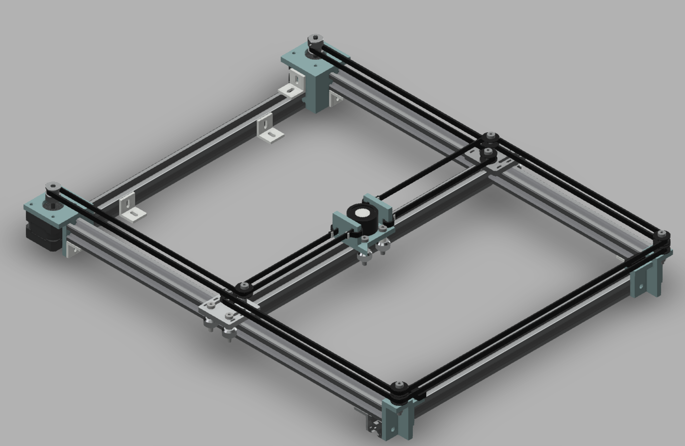](https://a360.co/3Shld8j)
* 3d-модель CheckMate [](https://skfb.ly/oEpMO)
    [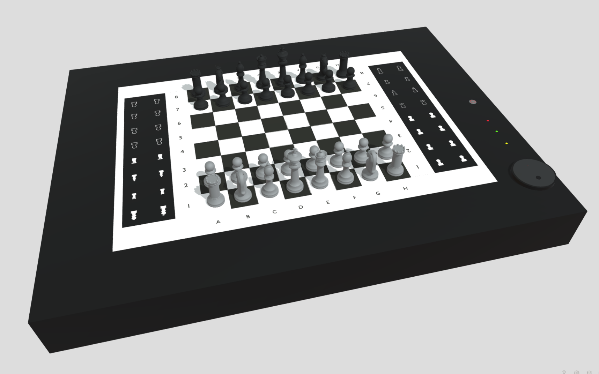](https://skfb.ly/oEpMO)

> Здесь представлена шахматная доска с обновленной наклейкой

## 3d-Рендеры

<p align="center">

</p>
<p align="center">

</p>
<p align="center">

</p>

## Функциональное описание в виде UML-Диаграмм

* Use Case Diagram (Диаграмма прецедентов)
    <p align="center">
    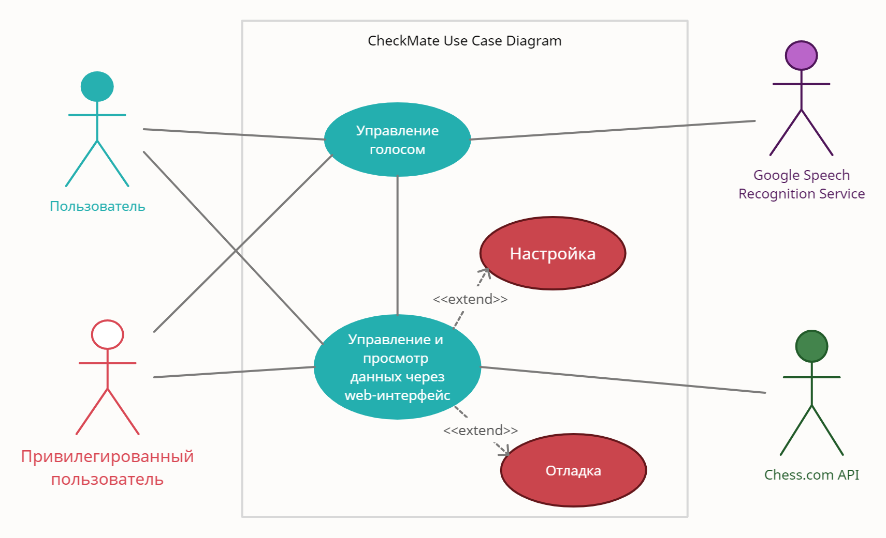
    </p>
* State Machine Diagram (Диаграмма состояний)
    <p align="center">
    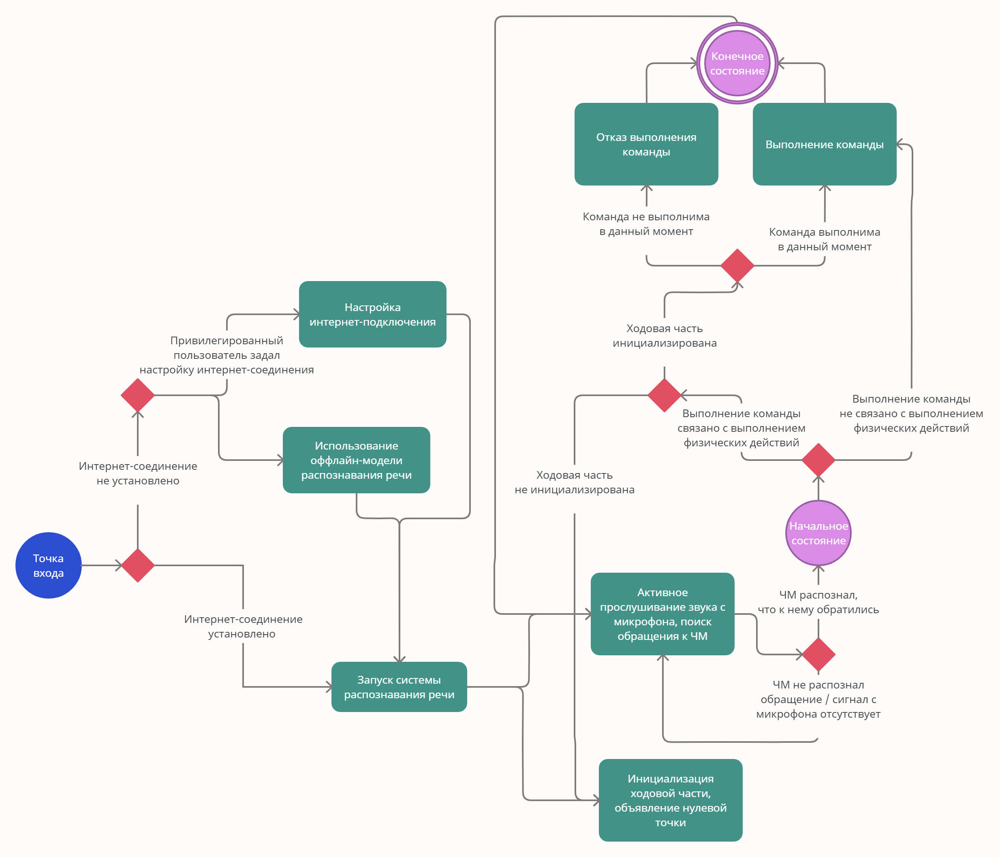
    </p>
* Sequence Diagram (Диаграмма последовательности)
    <p align="center">
    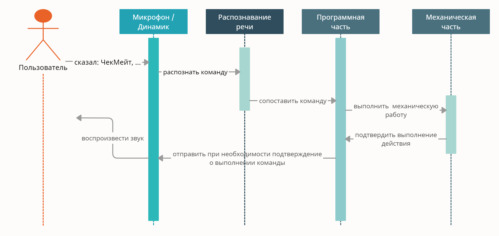
    </p>
* Component Diagram (Диаграмма компонентов)
    <p align="center">
    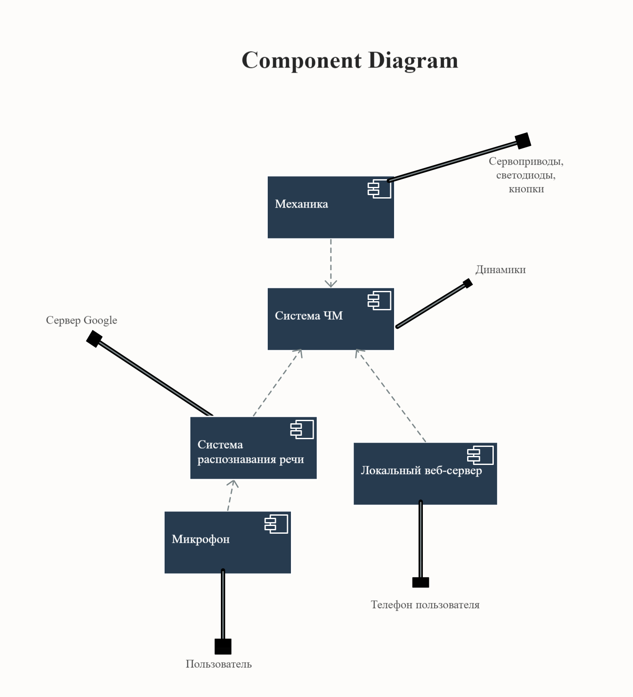
    </p>

## Исходный код

**⚠️ Мы отказались от полной публикации исходного кода в репозитории. Вместо этого была размещена только его малая часть. Это сделано для того, чтобы обезопасить себя от любителей воровать чужой код, ибо исходники являются интеллектуальной собственностью, а также коммерческой тайной.**

Часть исходного кода распололожена в каталоге [```src```](https://github.com/MOI-razrabotki/CheckMate/tree/main/src)

___

<p align="center" style="background-color:#0a0a0a">
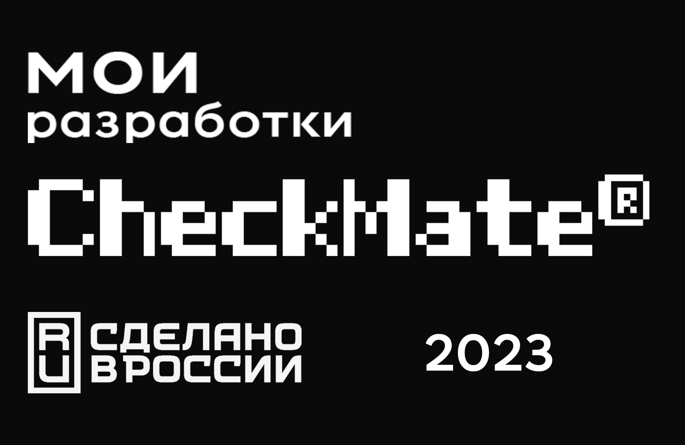
</p>
