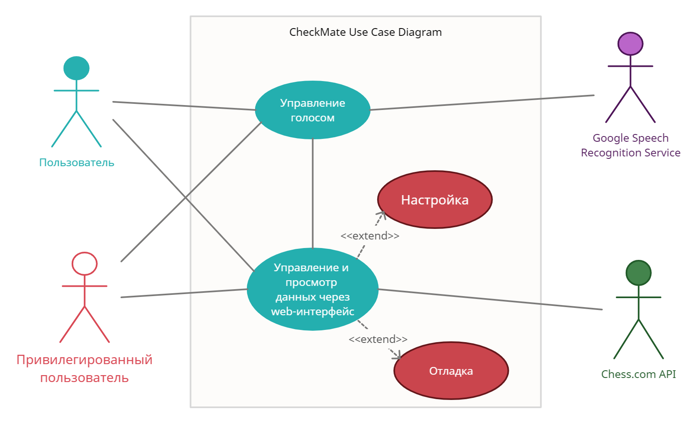
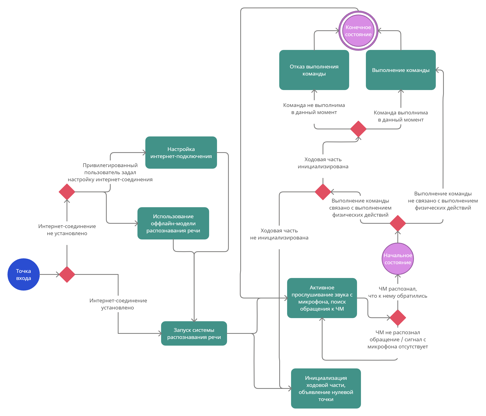
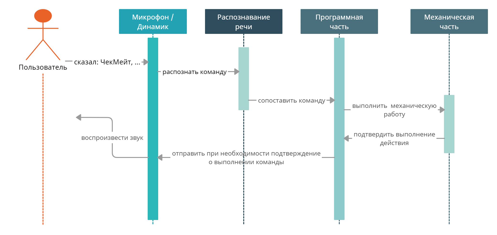
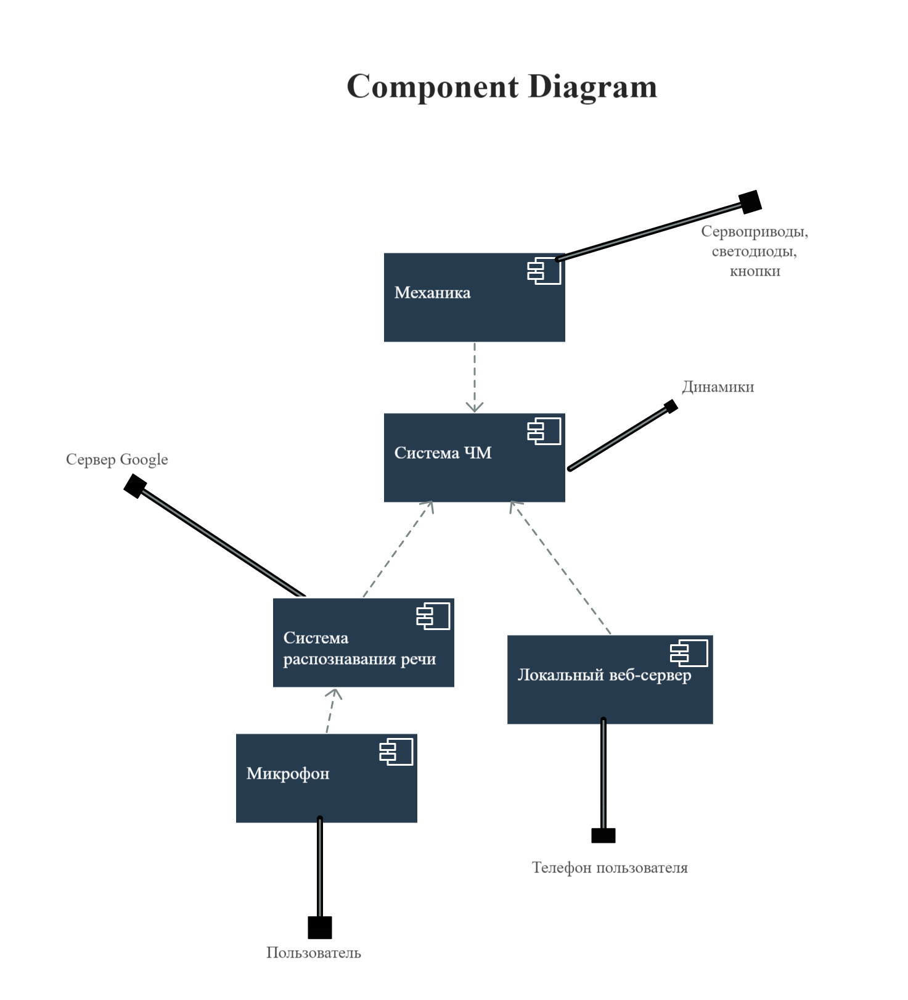

# CheckMate [](https://github.com/MOI-razrabotki/CheckMate)
> Шахматная доска с голосовым управлением и автоматизацией перемещения фигур


**CheckMate** ```(ЧекМейт)``` - это автоматизированные роботизированные шахматы с голосовым управлением. Игра идет против искусственного интеллекта, устройство воспринимает голосовые команды человека, а система перемещения выставляет фигуру на заданную позицию. Предмет автоматизации заключается в том, что человек не должен касаться игрового поля или фигур во время шахматной партии.

Работа над проектным решением велась с учетом следующих ограничений:
* Разметка поля и схема расположения шахматных фигур соответствуют классическим шахматам.
* Отработанные фигуры должны парковаться в отдельные поля для белых и черных фигур.
* Сторона квадрата клетки игрового поля должна удовлетворять условию: ```a < 1,8d```, где ```d``` — диаметр подошвы фигуры
* Габариты устройства не превышают размеров ```800х800х800мм```.
* Конструкция шахмат вместе с системой перемещения должна размещаться в едином корпусе и быть устойчивой в процессе перемещения.

<p align="center">
  
</p>

## Состав команды «МОИ разработки»
1. **Настя** - оформление и представление всего результата командной работы, презентацию проекта. 
1. **Кирилл** - подбор необходимых материалов и комплектующих, был ответственен за монтаж электротехнической схемы и сборку всего устройства. Также был оператором и монтажером видеоматериалов.
2. **Вадим**  - работа с программированием микрокомпьютера Raspberry Pi, разработка и внедрение алгоритмов искусственного интеллекта, распознавания речи, передвижения фигур и всей системы в целом.
3. **Андрей** - визуализирование в системе автоматизированного проектирования трехмерной модели совместно разработанному прототипу, его составных частей. 

## Видео разработанного продукта
* Командное видео с разработанным продуктом [](https://youtu.be/5s41Iof64gM)
    [](https://youtu.be/5s41Iof64gM)
* Видео с полным функционированием продукта [](https://youtu.be/UHgrxMTI6Ug)
    [](https://youtu.be/UHgrxMTI6Ug)

## Фотографии разработанного продукта

<p align="center">

</p>
<p align="center">

</p>
<p align="center">

</p>
<p align="center">

</p>
<p align="center">

</p>

## 3d-модели разработанного продукта

**⚠️ По причине опасения кражи наших 3d моделей было решено отказаться от прикрепления 3d моделей в виде файлов в тело нашего репозитория. Вместо этого было решено загрузить их на онлайн-сервис по просмотру 3d моделей.**

* 3d-модель Core-XY конструкции кареток [](https://a360.co/3Shld8j)
    [](https://a360.co/3Shld8j)
* 3d-модель ЧекМейта с измененными полями [](https://skfb.ly/oEpMO)
    [](https://skfb.ly/oEpMO)

## 3d-рендеры разработанного продукта

<p align="center">

</p>
<p align="center">

</p>
<p align="center">

</p>

## Электротехническая схема разработанного устройства

<p align="center">

</p>

## Функциональное описание в виде UML-Диаграмм

* Use Case Diagram
    <p align="center">
    
    </p>
* State Machine Diagram
    <p align="center">
    
    </p>
* Sequence Diagram
    <p align="center">
    
    </p>
* Component Diagram
    <p align="center">
    
    </p>

## Код продукта

**⚠️ По причине опасения кражи исходного кода было решено отказаться от его полной публикации в репозитории. Вместо этого была размещена только его малая часть.**

Часть кода распололожена в каталоге [```src```](https://github.com/MOI-razrabotki/CheckMate/tree/main/src)
